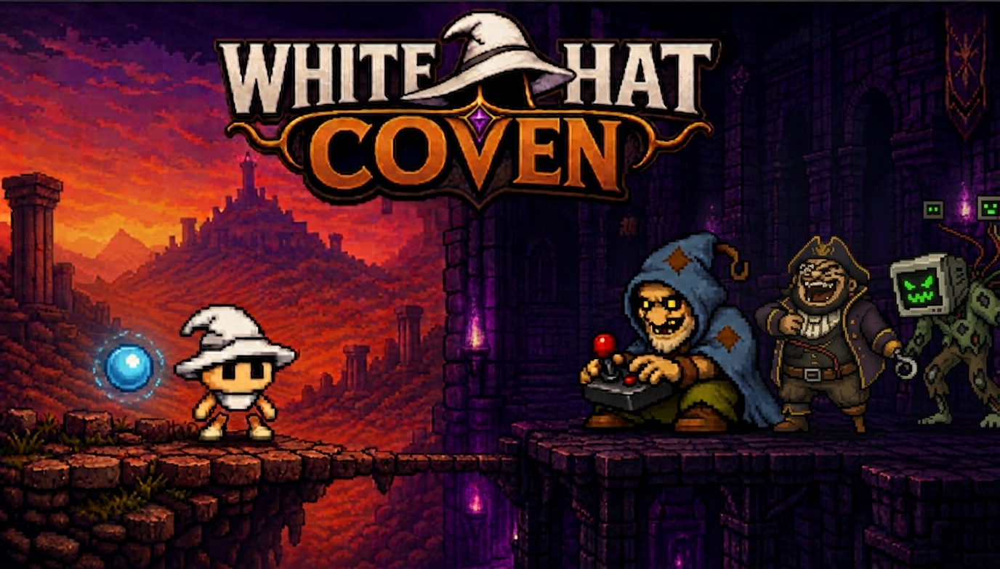

  

## Qual é o maior inimigo da cibersegurança?

Não é o malware da semana. É a falta de informação — e o fator humano.

Não existe dispositivo, no mundo desenvolvido, capaz de defender o sistema de uma casa se a pessoa desinformada deixa a senha de fábrica na câmera.

Esta iniciativa nasceu como um projeto de proteção de IoT. Pivotou para um jogo educativo de segurança porque a única forma de atacar o problema na raiz é entregar conhecimento. O obstáculo: quase ninguém quer aprender segurança. É chato. É alarmante. Parece coisa de especialista.

White Hat Coven nasceu dessa premissa: implantar a raiva real de estar aproveitando a vida — e o jogo — e alguém hackear o seu sistema no meio do caminho. Nesse instante, o conhecimento deixa de ser aula e vira a única ferramenta realmente efetiva para erradicar uma fatia enorme dos problemas de segurança digital.

## Como o jogo funciona

Você é um mago iniciante no coven dos White Hats. A missão é sair para combater os Black Hats: hackers que sequestram a tela no meio da partida.

O gênero é endless platformer vertical. Quem sobe mais alto, ganha. Mas não é um jogo comum desse tipo. A subida entra em flow — e, de repente, um boss invade a run como um ataque de verdade. Dá para lutar sem aprender nada: é possível, só que bem mais difícil e demorado. Ou você para, absorve uma técnica de segurança, ganha vantagem (um encanto) e volta para derrotar o invasor.

Conhecimento é poder. Literalmente.

## Para quem o jogo foi desenhado

Três pessoas. Três portas de entrada. Uma mesma casa.

### Rafael

Rafael é o público de entrada: o adulto do nicho tech, conectado, com nostalgia de jogos antigos. Foi pensado para ser o primeiro tester — e o primeiro a divulgar a proposta. Ele já entende o suficiente de tecnologia para se interessar. O que o prende não é o discurso de segurança. É o controle, o recorde, a briga justa com o boss.

### Gabriel

Todo Rafael tem, na linha do tempo, um Gabriel.

Gabriel tem entre 14 e 20 anos. É estudante. Gosta de jogar. É semente do futuro: o grupo que faz os hábitos de agora durarem. Se ele cresce com consciência de segurança digital, o efeito sobrevive a Rafael e a Cláudia. A via para chegar até ele é parceria com instituições de ensino — entregar acesso aos jovens onde eles já estão.

### Cláudia

Todo Rafael e todo Gabriel têm uma Cláudia em casa.

Cláudia é o alvo principal. Um dia a meta é chegar até ela: uma pessoa comum, que não entende de tecnologia nem de segurança, mas vive cercada de dispositivos inteligentes — e esse número só cresce. É um grupo delicado. Não gosta que a alarmem sem razão. O jogo existe porque não há melhor jeito de aprender o que você não quer aprender do que jogando — e descobrir, só depois, que aprendeu.

## O que prende: competição

O gancho principal do White Hat Coven não é aula. É disputa.

O jogo foi pensado para ranking — e, em breve, batalhas de altitude. O problema de muitos jogos de hoje é o tédio rápido. Competição quebra isso.

Rafael começa a jogar, se engancha e reta a tia, a mãe, a Cláudia da casa para bater o recorde. Depois reta o Gabriel. Os amigos de Gabriel entram. Os amigos de Rafael também. A família e os conhecidos de Cláudia entram no mesmo ranking. O ranking é global, mas filtra por zona: você compete com a gente da sua cidade pelo melhor posto.

Mais adiante entram as batalhas: você escolhe quem quiser no ranking e mede, na prática, quem sobe mais alto.

## Arquitetura

| Camada | Stack |
| --- | --- |
| App | Expo SDK 53, React Native 0.79, React 19 |
| Linguagem | TypeScript |
| Controle | Sensores de movimento (tilt) — o mago se move com o celular |
| Persistência atual | Local, no aparelho (`AsyncStorage`) |
| Áudio | expo-av |
| Build | EAS (Expo Application Services), perfil `preview` para testers |
| Plataforma | Android agora (`com.whitehatcoven.demo1`) |

O jogo vive neste repositório. A casa é própria: não é um minigame grudado em outro app.

## Arte

Cada asset visual do jogo — sprites, cenários, ícones, a capa acima — foi desenhado e criado por Kiron Garcia. Pixel art autoral, não banco de sprites.

## Por que isso importa

Segurança digital não vai se resolver só com produto mais esperto. Enquanto a senha de fábrica continuar na câmera da sala, o sistema da casa continua aberto.

White Hat Coven não pede que você assista a uma palestra. Pede que você suba. Quando a tela for sequestrada, você vai querer saber o porquê — e aí o conhecimento deixa de ser obrigação e vira a arma que faz você ganhar.
